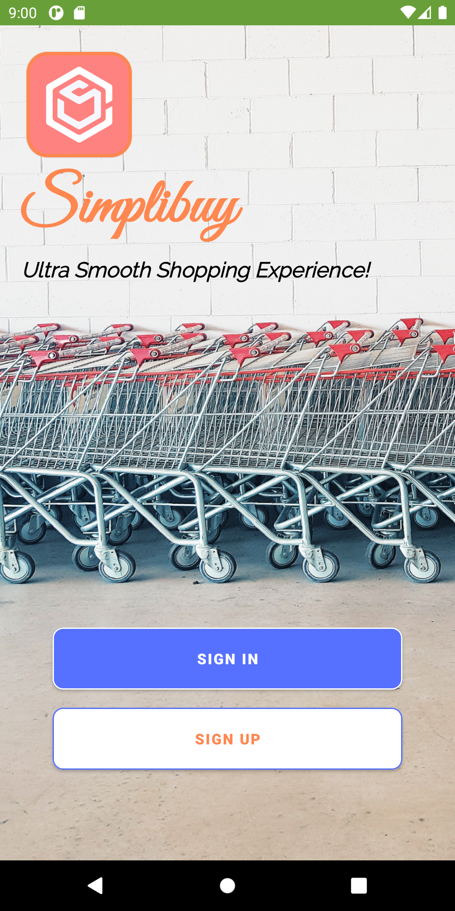

## Shopping App 

## Getting Started
Make sure you have Android Studio on your machine

1.  Clone this repository and cd into it
2.  Run the project with Android Studio
3.  Connect With Firebase 

### Prerequisites

* Android Studio

## Built With

* [Kotlin](https://kotlinlang.org/) - Kotlin language
* [Android Studio](https://developer.android.com/studio/) - Android Studio
